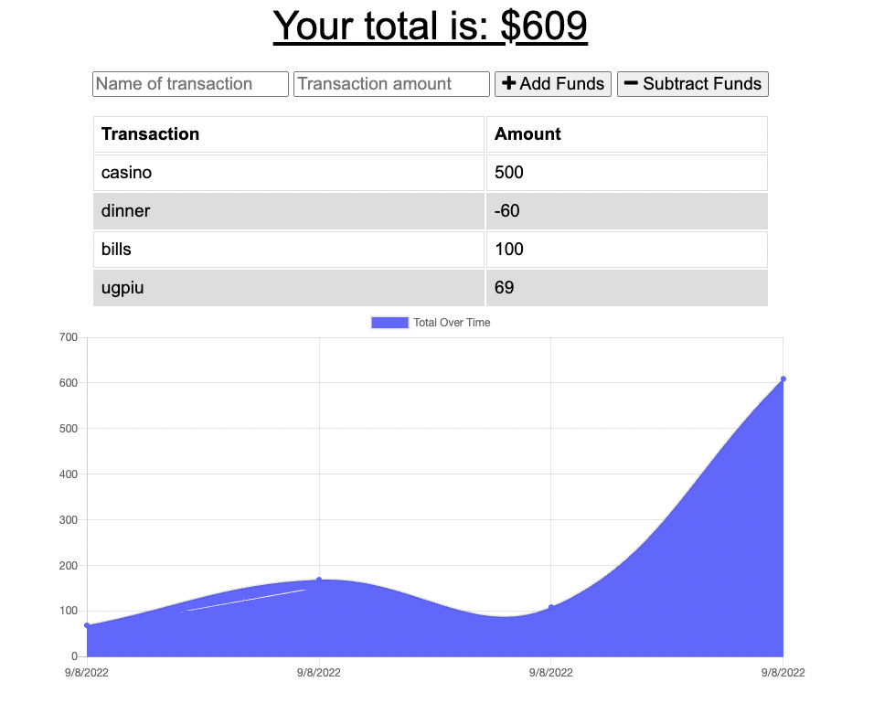

# budget-tracker

## Purpose
AS AN avid traveler
I WANT to be able to track my withdrawals and deposits with or without a data/internet connection
SO THAT my account balance is accurate when I am traveling 

## Table of Contents
- [Purpose](#purpose) 
- [Description](#description) 
- [Installation Instructions](#installation-instructions)
- [Demo Preview](#demo-preview)
- [Github Repository](#github-repository)
- [Deployed](#deployed)

## Description
GIVEN a budget tracker without an internet connection
WHEN the user inputs an expense or deposit
THEN they will receive a notification that they have added an expense or deposit
WHEN the user reestablishes an internet connection
THEN the deposits or expenses added while they were offline are added to their transaction history and their totals are updated

## Installation Instructions  
Clone repo, npm i, npm start and go to Localhost:3001 in your sever
 
## Demo Preview

## Github Repository
https://github.com/macykcool/budget-tracker

## Deployed

## Made with ❤️️ by Macy Mannix
Mentored by UC Davis Full Stack Web Developer Bootcamp